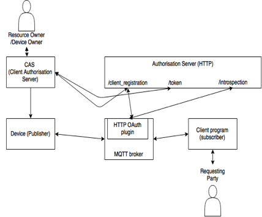

# MQTT_TLS profile for ACE - Prototype implementation

## Design


For the publisher/subscriber clients to connect to the broker, they have to present a token in their CONNECT messages. 

The system consists of four entities: 
1.	The client authorization server: The client authorization server will acquire a token on behalf of the device. Currently emulated with Curl. 
2. Client: Clients publish and subscribe to topics with the MQTT broker. *mosquitto_pub* and *mosquitto_sub* clients are modified as ACE clients.
3.	The MQTT broker: The MQTT broker is the default Mosquitto broker. It uses an extended *mosquitto_auth_plugin* to connect to the ACE backend.
4.	The Authorization Server: The Authorization server is implemented in Express/Node.js. The database is in MongoDB and stores client registrations, tokens, and policies.

### AS endpoints
#### client registration (dyn_client_reg): 
Supports dynamic client registration according to IETF RFC 7591 Dynamic Client Registration and, to a certain extent, the experimental IETF RFC 7592 Dynamic Client Registration Management.
#### token: 
Used by the CAS to request Proof of Possession tokens. These tokens must be generated by the AS and consumed by the RS. A Proof of Possession token is an access token bound to a cryptographic key. RS uses the PoP key to authenticate the client. Access tokens are opaque to the client.
#### introspection: 
The introspection interface is used by the MQTT Broker/RS to pass a token for introspection. This is done using an extension of the Mosquitto auth plugin. Access tokens are currently reference tokens.  In the future, it is planned to support self-contained tokens.  If the access token is self-contained, then the RS may not need to introspect. On the other hand, RS may still want to introspect a self-contained token if the authorization decisions are very dynamic.  Access tokens that are not introspected may need to be revoked by the authorisation server (no standard specification supports this).
 
### Key concepts
#### Topics
Topics are resources.  Wildcard topics are not supported at the moment.
#### Resource Owner
The resource owner is the entity that can authoritatively talk about the resource. In our system, resource owner is the topic owner.
#### Policy
A policy binds (client_id) to a (resource_name) owned by (owner_name).
The policy supports two types of permissions:“pub” and “sub”.

Example policy:
```json
{
	"resource_name" : "resource name",
	"owner_name" : "owner name",
	"client_id" : "client id",
	“scopes” : [“pub”, “sub”],
	“policy_expires_at”: "data"
}
```

More complex policies can be supported, for instance, by XACML, and are left for future work.

#### Token
We use tokens by reference. An example token kept by AS:
```json
{
    "profile": "mqtt_tls", 
    "token_value_hash": "token value hash"  , 
    "token_type" : "pop", 
    "iss":  "Nominet", 
    "sub":  "client_id", 
    "aud":  "topic", 
    "exp":  "expiration time", 
    "scope": "pub",
    "cnf":   "pop key"
} 
```
Limitations: We currently do not support multiple topics in tokens. 

Other ideas for `scope`: 
1. Make scope a special word such as `action_topic`.  The acceptable verbs for action are “pub” and “sub”. The topic follows the same model as MQTT, including the wildcards.
2. Create a Base64 encoding for 
[“permission”:”pub”, “topic”:”/topic/sensor1/#”]
and use this string for `scope`. 

## Prerequisites
This system requires the following before authentication/authorization can take place:
1.	Privacy policies regarding which topics can be published/subscribed to are configured at the Authorisation Server by the Resource Owner. The definitions for  topic, resource and resource owner, and policy are presented in the *Definitions* section.
2.	Clients and the broker are registered with the AS.  For this, AS provides dynamic client registration endpoint.
4. Both publisher and subscriber discovered the MQTT broker, and subscriber learned about the topics published by the MQTT broker.

## Tests:

1. AS returns tokens to pub/sub clients if RO has a policy for the client. [PASSED]. 
2. AS does not returns tokens to pub/sub clients if RO does not have a policy for the client. [PASSED].
3. The pub/sub clients can pass the token to the broker in CONNECT request. [PASSED]
4. The broker can use the introspect interface to validate token. [PASSED]
5. The broker can deny Publish connections if topic is not covered in token. [PASSED]
6. The broker can use stored tokens to check subscribe permissions when a new message to the topic published and denies forwarding messages not covered by topic. [PASSED]
7. The broker does not accept expired tokens. [PASSED]
 
## Limitations/ToDo:

1. Digest Algorithm defaults to SHA256.
2. The Token is encoded base32 because it is passed as a username to the mosquitto broker, and is not allowed to have the "+" character. (crypto.random function to generate the username may use + character).
3. The subscribers are not disconnected immediately at connection time if their token does not match the SUBSCRIBE request. This is because ACL checks are temporarily disabled in the mosquitto broker. But, they are never forwarded the messages published to unauthorised topics. 
4. Auth plugin (and also ACE) does not support wildcards. 
5. Does not support multiple topics in a single token. 
6. Auth plugin does not support curl --cacert option. 


